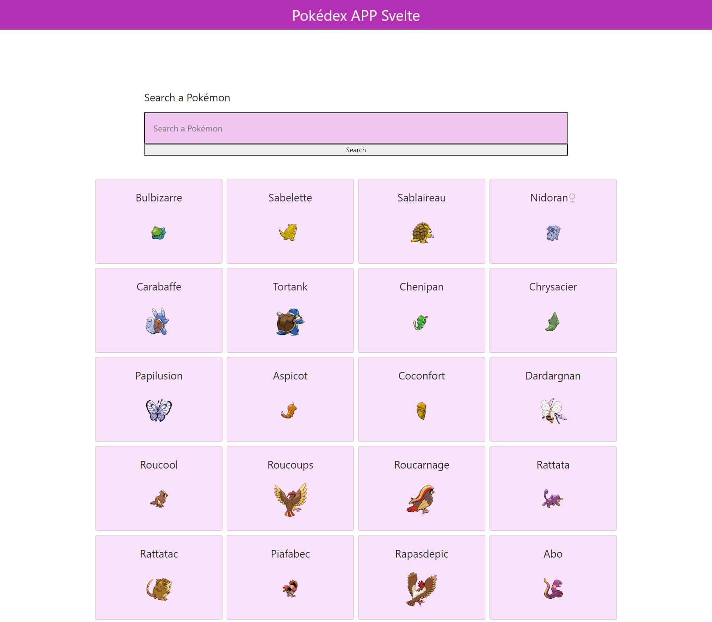
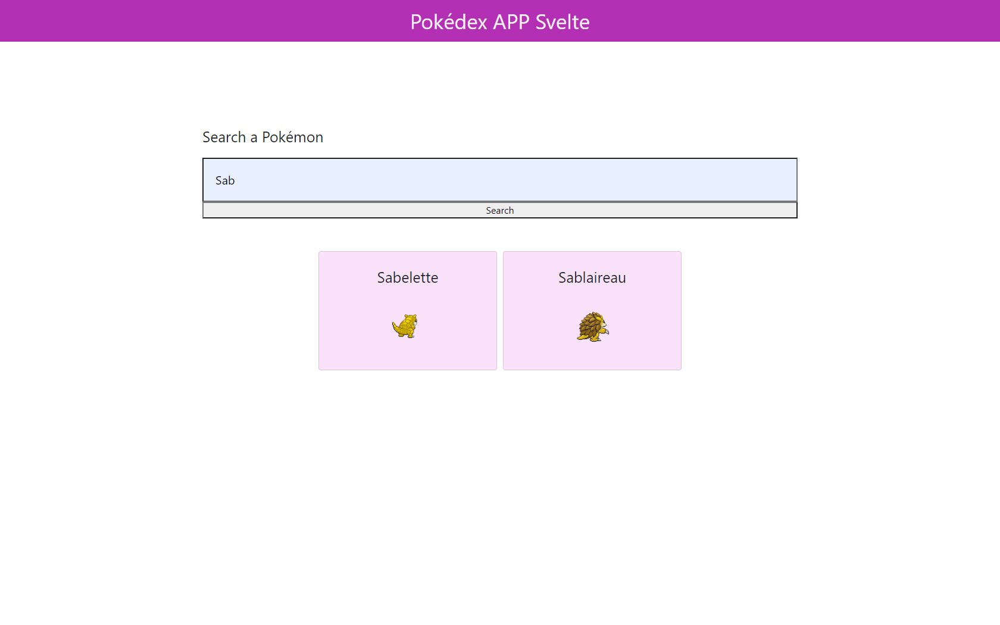

# Svelte.js - Pokédex

November 2020

> 🔨  Pokédex made with Svelte using Pokémon API.
>
> From Udemy: [Svelte de A à Z](https://www.udemy.com/course/svelte-de-a-a-z/)

* * *

[Demo on Heroku](https://raigyo-svelte-pokedex.herokuapp.com/)

<h1 align="center">
    
</h1>

## About

Applcation that fetches a Pokémon API.

It displays Pokémons by name (in French) and display an image of the creature.






Tip: disable *autosave* when you work with api, otherwise it will make tons of not useful request.

## How to test

- Clone
- `npm install`
- `npm run dev`

## How to make a Github page

- Pages must be served with Sapper
- Link the app to a Github repository
- `npm install -D gh-pages`
- Modify *package.json*

````json
"scripts": {
    "dev": "sapper dev",
    "build": "sapper build --legacy",
    "export": "sapper export --legacy",
    "start": "node __sapper__/build",
    "deploy": "sapper export --legacy &&  gh-pages -d __sapper__/export"
},
````
- `npm run deploy`
- set the gh-pages branch that was just deployed as the main branch for GitHub Pages to read from.

## How to deploy on Heroku

- `heroku login`
- `heroku create my-app`
- `git push heroku HEAD:master`

## "fetch" is not defined

Use :

`import { onMount } from 'svelte'`

````js
  onMount(async () => {
    const fetchPokemonBase = () => {
      fetch('https://pokeapi.co/api/v2/pokemon/?limit=151')
      // ...
  });
````

## Useful links

- [Svelte.js](https://svelte.dev/)
- [Sapper](https://sapper.svelte.dev/)
- [Getting started with Svelte](https://developer.mozilla.org/en-US/docs/Learn/Tools_and_testing/Client-side_JavaScript_frameworks/Svelte_getting_started)
- [Svelte training sources](https://github.com/Ziratsu/SourceSvelte)
- [Page npm UUID](https://www.npmjs.com/package/uuid)
- [Creating a blog with Svelte, Sapper and GitHub Pages](https://newcurrent.se/blog/create-markdown-sapper-svelte-blog)
- [Sapper - Deploy with Heroku](https://www.youtube.com/watch?v=2ABeij8BxCI)
- [The RESTful Pokémon API](https://pokeapi.co/)
- [To Fetch API: onMount handle](https://svelte.dev/tutorial/onmount)
